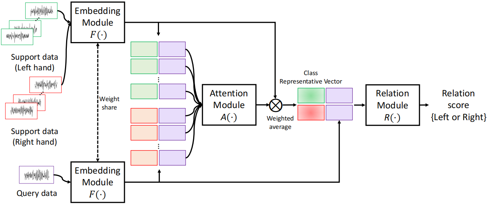
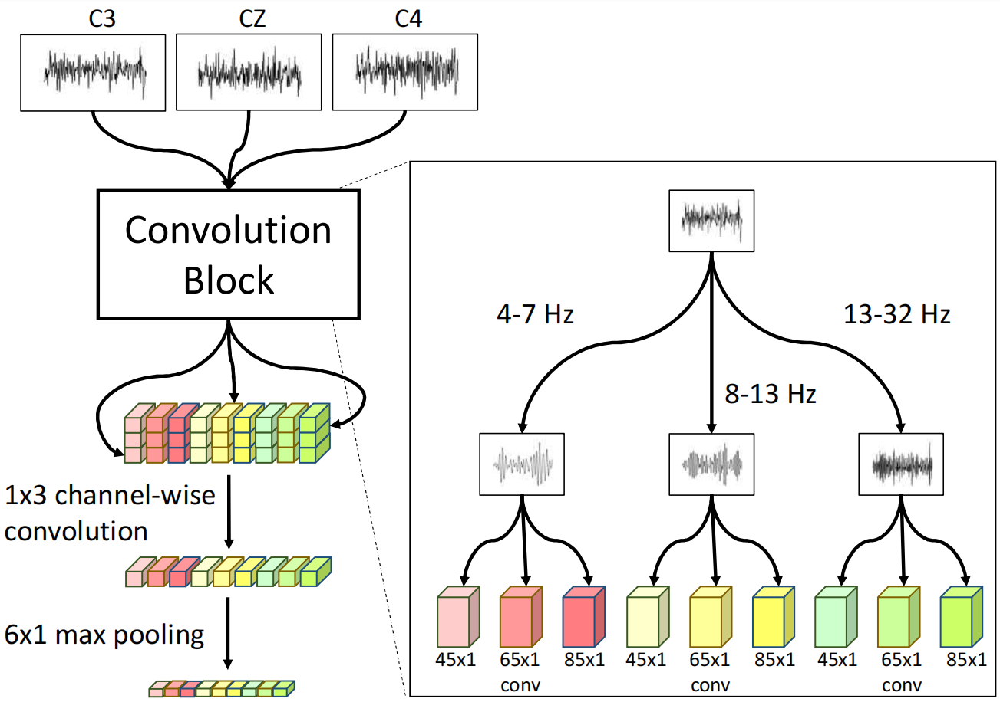
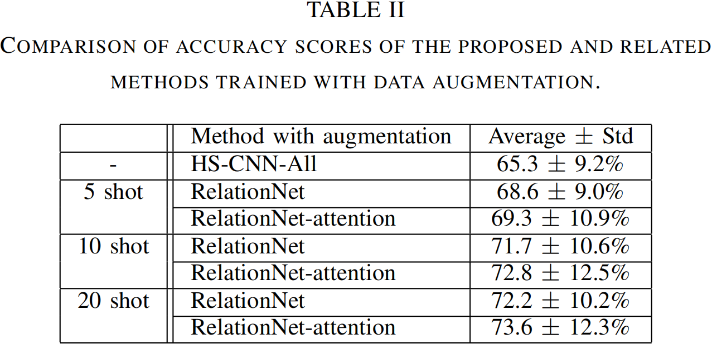
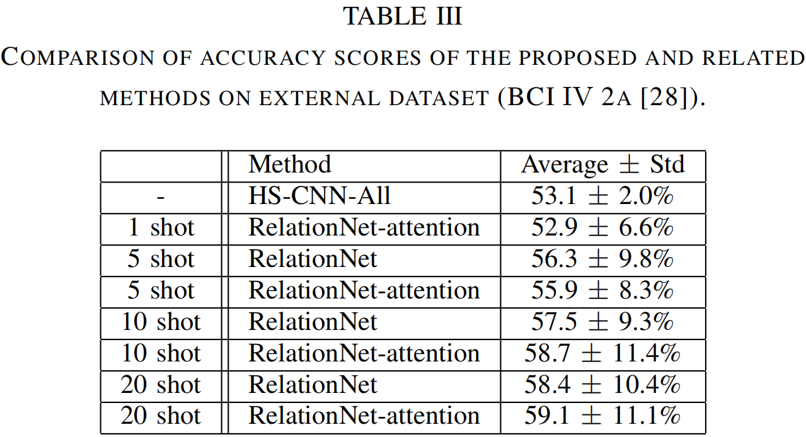

__《基于运动想象分类的注意力小样本学习》__
<!-- more -->

# **Abstract**
本文提出了一种 `two-way few-shot` 网络，该网络能够有效地学习MI特征并分类，其主要结构包括：
- 特征表示嵌入模块
- 注意力模块
- 基于 `support set`和 `query set` 的关系网络。
  
## **METHOD**
  
  
图1. 2-way K-shot learning framework

  如图1，本文的框架由三个模块组成：嵌入模块、注意模块和关系模块。

$A.Embedding Module$   
本文作者基于[HS-CNN](https://iopscience.iop.org/article/10.1088/1741-2552/ab405f/meta)网络进行修改，使用四阶巴特沃斯带通滤波器将数据分成3个不同的频带（对应图2.），并使用不同尺度的 `1D` 卷积提取每个频带的特征，详见图2。 

图2、嵌入模块的具体结构

$B.Attention Module$    
`N-way k-shot` 的支持集包含 $N*k$ 个数据样本，在原始的关系网络中，这些样本嵌入后的特征等权重的都进行查询预测，但是如果支持集中存在噪声样本，则会影响预测的准确性。因此为了更好的解决该问题，作者提出了基于注意力模块：将每个支持集的特征向量 $z_{i,j}^{S}(i=1,2,N;j=1,2,k)$ 和查询集的特征向量 ${\mathcal{Z}}^{Q}$ 在通道维度进行连接 $z_{i,j}^{S Q}=z_{i,j}^{S}\oplus z^{Q}$，计算注意力分数 $a_{i,j}^{S}=A(z_{i,j}^{S Q})$ ，注意模块由使用 16×1 和 4×1 核的卷积层、全局平均池层和 64 个一维全连接层组成，以考虑全局和局部特征。
举个例子，对于每一个类别，$\overline{z_{i}^{S}}$ 注意力加权的特征计算如下：
$$
\overline{z_{i}^{S}}=\frac{\sum_{j=1}^{k}a_{i,j}^{S}*z_{i,j}^{S}}{\sum_{j=1}^{k}a_{i,j}^{S}}
$$
然后将特征向量 $\overline{z_{i}^{S}}$ 与 $ z^{Q} $ 串联：$z_{i}^{S Q}=\bar{z}_{i}^{\bar{S}} \oplus z^{Q}$ ，得到 $z_{i}^{S Q}$ 用于标签的预测。

$C.Relation Module$    
  关系模块使用两个具有30×1和15×1核的卷积层、一个全局平均Poing层和两个维度为256和100的完全连接层对 $z_{i}^{S Q}$ 预测，将预测关系得分最大的类作为标签。

$D.Implementation details$   
对于训练，我们使用交叉熵损失函数优化模型，如下所示：
$$  
  {\cal Loss=-\frac{1}{N}\ast\sum_{i=1}^{l N}y_{i}\ast log(r_{i}^{S}),}$$
其中，如果支持数据的类别与查询数据的类别相同，则 $\ y_{i}$ 为1，否则为0。

##  **EXPERIMENTAL RESULTS**
$A. Dataset$    
>BCI竞争IV 2b数据集用于评估网络性能。数据集包含9名MI分类受试者的原始EEG数据，每个实验约120次试验，其中每个受试者根据指令想象左手或右手运动。在每个受试者上进行了五个实验，共从9个受试者收集了45个实验。根据国际10-20系统的协议，在三个电极C3、CZ和C4上以250Hz的采样频率测量采集的样品。在5400个试验（即120×45）中，我们忽略了一些被拒绝的试验，然后在本研究中使用剩余试验的3.5s到7s的信号。从3个电极中，作者获得了三个875值，并将它们叠加形成875×3矩阵，作为模型的输入。

$B. Experimental Setting$ 
>在本文的实验中，使用了9折交叉验证，使用8名受试者数据样本对模型进行训练，并对每个验证事件的剩余部分进行测试。每个训练集由每名受试者的前四个实验组成，第五个实验用作验证集。测试集由剩余的全部受试者组成。在训练期间，支持和查询数据样本在每次迭代时从训练和验证集中随机选择的。为了测试，我们在每个类中将整个样本分成两组，20个样本作为支持，其余作为查询数据。  
为了评估所提出的模型（RelationNet注意力）的性能，作者评估了K={1,5,10,20}镜头分类模型的分类精度。对于K={1,5,10}激发实验，从20个支持样品中随机选择K个支持样品。为了评估注意力的影响，我们还评估了没有注意力的5、10和20个镜头模型（RelationNet）的性能。此外，本文方法与以下两种监督学习模型进行了比较：HS-CNN 在测试受试者的支持集中仅使用 40 个样本（20个左样本和20个右样本）进行训练（HS-CNNlevel），以及（2）使用8个受试者（HS-CNNAll）的所有训练样本进行训练。由于结果可能随着支持集的变化而变化，因此重复10次相同的实验，并将平均值用作所有情况下的最终精度。准确度是根据整个数据集上的真阳性和真阴性的数量进行测量的。

$C. Results and Analysis$
>表1显示了建议方法和其他方法的总体精度和标准偏差。图3以图表形式显示了9倍的方法的精度。在所有情况下，我们的模型都比以前的方法实现了更好的性能。具体而言，基于监督学习的方法报告，当使用从目标对象获取的足够的训练数据时，分类性能达到87.6%，但当模型在跨对象设置中训练时，性能显著下降到65.3%。当使用从目标受试者获取的少量数据（每类20个样本）训练模型时，精度也受到限制。另一方面，提出的少镜头学习技术大大提高了性能。在单次拍摄设置中，每个目标受试者仅使用一个标记样本进行训练，与HSCNN All相比，观察到性能提高1.7%，5次拍摄提高4.9%，10次拍摄提高6.4%，20次拍摄提高8.6%。最后，我们的方法在注意设置的20次射击中达到74.6%（+9.3%）的平均准确率。(待整理)      

$D. Effect of data augmentation in the few shot setting$

数据增强后的9折，如表2：        

跨数据集（BCI competition IV 2a ）如表3：

