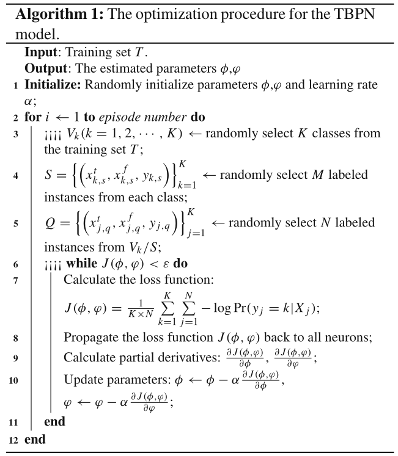

基于时频两分支原型网络的旋转机械小样本故障诊断

<!--more-->

## **Abstract**

基于时、频域双分支构建原型网络（TBPN）：

- 分别提取振动信号的时域频域特征
- 通过度量学习学习每个故障在时域和频域中的原型表示，并计算故障原型和查询故障特征间的距离
- 将时域和频域中的距离进行整合，并通过 `softmax` 函数进行分类

## **网络结构：Two-branch prototypical networks**

### **Problem definition**

FSL 的目标是使用训练集和支持集 S 的信息对查询集 Q 进行分类。具体地说，如果训练集包含 K 个类，并且支持集 S 中的实例，每个标记的实例都有 M 个标记，则该问题称为 `K-ways M-shot` 学习。（具体有待补充）

### **Architecture of TBPN**

数据源包含两个：原始时域数据以及经[FFT](https://docs.scipy.org/doc/scipy/reference/generated/scipy.fftpack.fft.html#scipy.fftpack.fft)变化的频域数据。

- Feature extractors for time domain and frequency domain
  如图 1，将时域信号频域信号分别 1D 卷积进行特征提取，具体网络结构（参数见原文太过简单不再详细描述）

- Metric learner  
  在查询集 $Q_j=\left(x_j^t, x_j^f, y_j\right)$ 中，需要计算类 $k$ 的原型与嵌入后的实例之间的距离，计算 $x_j$ 时域特征编码向量到时域原型中心 $C_k^t$ 之间的距离：$d\left(f_\phi\left(x_j^t\right), C_k^t\right)$ 以及 $x_j^f$ 的频域特征编码向量到频域原型中心的距离：$d\left(f_\varphi\left(x_j^f\right), C_k^f\right)$

- **Networks aggregation**  
  将两个分支的输出进行融合，两个分支的输出可以级联、相乘或平均，本文作者尝试将两个分支的输出进行平均，首先对距离归一化：
  $$\operatorname{prop}\left(d_k\right)=\frac{d_k}{d_1+d_2 \cdots+d_K}, \text { for } k=1,2, \cdots, K$$
  然后引入超参数 $\lambda$ 控制分支的权重，基于 `softmax` 函数计算类别 $x_j$ 的概率，具体计算公式如下：
  $$
  \operatorname{Pr}\left(y_j=k \mid x_j\right)=\frac{\exp \left(-\lambda \times \operatorname{prop}\left(d\left(f_\phi\left(x_j^t\right), C_k^t\right)\right)-(1-\lambda) \times \operatorname{prop}\left(d\left(f_{\varphi}\left(x_j^f\right), C_k^f\right)\right)\right)}{\sum_{k=1}^K \exp \left(-\lambda \times \operatorname{prop}\left(d\left(f_\phi\left(x_j^t\right), C_k^t\right)\right)-(1-\lambda) \times \operatorname{prop}\left(d\left(f_{\varphi}\left(x_j^f\right), C_k^f\right)\right)\right)}
  $$

### **Optimization algorithm**

每个元任务的基于负对数概率的损失函数定义为：

$$
J(\phi, \varphi)=\frac{1}{K \times N} \sum_{k=1}^K \sum_{j=1}^N-\log \operatorname{Pr}\left(y_j=k \mid x_j\right)
$$

分别对 $\partial$ 和 $\phi$ 求偏导：

$$
\frac{\partial J(\phi, \varphi)}{\partial \phi}=\frac{1}{K \times N} \sum_{k=1}^K \sum_{j=1}^N-\left(\frac{\partial Z_{j, k}}{\partial \phi}-\frac{\sum_{k=1}^K \frac{\partial Z_{j, k}}{\partial \phi}}{\sum_{k=1}^K \exp \left(Z_{j, k}\right)}\right)
$$

$$
\frac{\partial J(\phi, \varphi)}{\partial \varphi}=\frac{1}{K \times N} \sum_{k=1}^K \sum_{j=1}^N-\left(\frac{\partial Z_{j, k}}{\partial \varphi}-\frac{\sum_{k=1}^K \frac{\partial Z_{j, k}}{\partial \varphi}}{\sum_{k=1}^K \exp \left(Z_{j, k}\right)}\right)
$$

在一个 `K-ways M-shot` 分类任务中，通过从训练集中的所有类中随机选择 K 个类来形成元任务。然后，从每个类中随机选择 M+N 个标记实例，其中，M 个观察变量用于形成支持集 `S`，其余 N 个用于形成查询集 `Q`。在每个训练迭代中，处理包含一个或多个元任务的小批量，并在 `mini-batch` 中的元任务之间平均梯度，并更新模型参数。图 2 中提供了用于计算训练集损失的伪码 $J(\phi, \varphi)$。

图2.TBPN模型的优化过程

### **Experiment setup and The results**

略....(~~介于本人不做该方向因此省略 1w 字~~)
