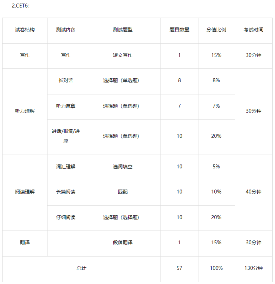

题型数值分布、简要技巧

<!--more-->

# 四六级听力技巧(35%\*710=248)：

- **跟读**:拿出几段四六级听力题，每天跟着录音读半个小时，一定要尽力去模仿素材里的语速，连读，重音!

- **略听**:而略听就是你在听素材时，手边备一张纸一支笔，集中精力听的同时把素材中出现的名词形容词尽可能的默写下来，尤其是地名、人名、数字、日期等特殊名词。

- **划重点词汇**:考试痴都会有几十秒的废话时间和审题时间，这时快速地扫视所有答案和题目备选项，将所有的特殊名词 (数字，人名，地名，日期等) 圈出来。

# 四六级阅读技巧(30%/210)：

- **勾选题干关键词，然后排除这些选项**:
  和题目完全对不上号的，题目在说世人对这个人的评价，有个选项却说他大学在哪读的。特别肯定或完全否定，标志性词汇 all,must，排除了这些选项，我们再回到原文中定位就很简单了。
- **有一部分基础题很好得分，在原文中可直接找到，飘过型选手要保证这类题不失分**:
  四六级的阅读题目，百分之九十是按顺序出题的，而且几乎每一段都会涉及到。阅读理解是能决定你阅读得分率高低的重点，所以一定要认真对待，平常做题的时候不读素材,对照着答案详解仔细认真的审视一下自己做错的题，错题的经验是很宝贵的，宁愿—套卷子翻来覆去的做，也不要用题海战术做过就丢。

# 四六级选词填空&信息匹配类(5%/35)：

- 考试之前抽点时间，把近年真题出现的这道题的备选单词分类摘抄下来，(名词，动词，形容词，副词)。

- 抽时间用之前讲到的背单词的方法多看看，熟悉一下意思，不至于在考试的时候无从下手，做题的时候严格的控制时间，最好在五分钟以内。

- 做信息匹配类题，要学会标注重点词汇，这个和听力大同小异(特殊名词,形容词等)，定位好之后就可以回到原文中看了，记住一定要扫视，就看你勾的词!

# 四六级翻译技巧(15%/106):

- 中英文对照逐句翻译，保持翻译顺序的一致性，不要多句混合翻译。

- 先确定句子的主谓宾，先有主题再有内容。先说对再说高端。

- 逐字逐句翻,不要漏掉关键词，量词，程度副词等。

- 不要空着，遇到不会的难点，用会的简单词，把意思表达出来即可，写上才能有机会

# 四六级写作技巧(15%/106):

- 拿出历年真题的范文，多看看，勾出开头句结尾句，转折词，搜集到你的小本子上，还有一些你觉得犹如神来之笔的句式。

- 四六级作文结构大于内容，三到五段，结构清晰，用词不要求高难度词汇，有些平常词汇用准确就好，毕竟拼写错了也要扣分滴金 √ 句式不要刻意追求从句，复杂句，但也不能通篇简单句，多看看范文是怎么写的。

Notes:

