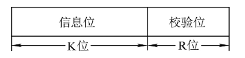

嵌入式系统设计师考试大纲

<link rel="stylesheet" type="text/css" href="auto-number-title.css" />

_Notes_:
（I）、（II）和（III）表示掌握或熟悉的程度：

- （I）是指对所列知识要理解其内容及含义（理解）。
- （II）指在有关问题中能直接使用（一般应用）。
- （III）是指对所列知识要理解其确切含义及与其他知识的联系，能够进行叙述和解释，并能在实际问题的分析、综合、推理和判断等过程中运用（综合应用）。

# 考试科目 1：嵌入式系统基础知识

## 计算机系统的基础知识

### 数制及其转换

#### 二进制、八进制、十进制和十六进制等常用数制及其相互转换（II）

答：
2<-->8：3 位二进制对应 1 位八进制数，不足时补 0
2<-->16：4 位二进制对应 1 位十六进制数
2<-->10：n 位二进制数转十进制对应$2^{n-1}$累加，十进制转二进制使用短除法
8、16<-->10：先转二进制再转八、十六进制

### 数据的表示

#### 数值的原码、反码、补码、移码表示，定点数和浮点数，精度和溢出（II）

答：
原码：第一位为符号位，8 位二进制取值范围为：[1111 1111, 0111 1111]。表示范围[-127, +127]
反码：正数的反码是其本身；负数的反码在源码的基础上，符号位不变，其余位取反。表示范围[-127, +127]
补码：正数的补码是其本身；负数的补码在反码的基础上+1。表示范围[-128， +127]
移码：将符号位取反的补码

浮点数：$N = R^e*M$（M 为尾数，e 为指数/阶码，R 为基数）；阶码决定数值的范围，尾数决定数值的精度
定点数：固定小数点的位置（小数点越靠左，整个数值范围越小；小数点越靠右，数值精度越低）

#### 字符、汉字、声音、图像的编码方式（I）

答：
字符编码方式：

- ASCII：使用 7 位二进制数表示 128 个字符（英文字母、数字和一些常见符号）
- UTF-8：可变长度编码，几乎可以表示所有字符

汉字编码方式：

- GB2312：中国国家标准，使用两个字节表示常用汉字字符
- GBK 是 GB2312 的扩展编码，表示公衡多汉字
- Unicode：国际常用汉字编码，使用两字节表示汉字

声音编码方式：

- PCM：将模拟声音信号转换为数字信号的编码方式，常用于音乐和传输声音数据
- MP3：是一种有压缩的音频编码方式，可以将声音压缩为较小的文件大小，常用于音乐和语音的存储和传输。

图片编码方式：

- JPEG：是一种有损压缩的图像编码方式，常用于存储和传输照片和图像。
- PNG：是一种无损压缩的图像编码方式，常用于存储和传输图标和界面元素。
- GIF：是一种支持动画的图像编码方式，常用于表情包和简单动画的存储和传输。

#### 校验方法和校验码（奇偶校验码、海明校验码、循环冗余校验码）（II）

答：

- 奇/偶校验码：整个校验码（有效信息位+校验位）中 1 的个数为奇/偶数
- 海明检验码：k 位校验码，n 位信息码，满足$2^k {\geq} n+k+1$；海明码规定，校验码$P_i$要放在海明位号为$2^{i-1}$位置上；海明码具有 1 个比特位的纠错能力，和 2 个比特位的检错能力。
- 循环冗余校验码：收发双方约定好一个 生成多项式 G(x) ，发送方基于待发送的数据和生成多项式计算出 R 位校验码 ，将其添加到 K 位信息码 （待传输数据）的后面一起传输。对接收收到的信息与生成多项式系数所构成的比特串相除，看余数是否为 0
  
  [参考文献](https://blog.csdn.net/qq_46331050/article/details/122115456)

### 算术运算和逻辑运算

#### 二进制数运算方法（II）

答：
二进制数加法：逢二进一
二进制数减法：借一有二
二进制数乘/除法：按十进制来就行
逻辑“或”运算：有一出一
逻辑“与”运算：同一出一
逻辑“异或”运算：相同出 0，不同出 1

#### 逻辑代数的基本运算和逻辑表达式的化简（I）

答：[逻辑代数的基本运算法则](\imgs\嵌入式软考\逻辑代数的基本运算法则.png)

### 计算机组成和主要部件的基本工作原理

#### CPU 和存储器的组成、基本工作原理

- CPU 的基本组成与工作原理（II）
  答：
- 存储器的组成及特点（II）
- 信息存储的字节顺序（大端存储、小端存储）（II）

#### 常用 I/O 设备、通信设备的性能以及基本工作原理（I）

#### I/O 接口的功能、类型和特点

- I/O 接口的基本组成与主要功能（II）
- I/O 接口的分类（I）
- I/O 接口的控制方式及特点：程序查询方式、中断处理方式、DMA（直接存储器存取）传送方式等（II）

### 计算机体系结构

#### CISC、RISC、流水线技术、超标量等（I）

#### 多处理机，并行处理，分布处理（I）

#### 冯·诺伊曼结构与哈佛结构（I）

### 可靠性与系统性能评测基础知识

#### 诊断与容错

- 故障诊断（I）
- 容错技术与容错控制（I）

#### 系统可靠性分析评价

- 系统的可靠性定义（I）
- 串联系统特点及可靠性度量（I）
- 并联系统特点及可靠性度量（I）
- N 模冗余系统等可靠性模型的特点（I）

#### 计算机系统性能评测方法

- 平均无故障时间的定义及计算（I）
- 平均修复时间的定义及计算（I）
- 可用性的定义及计算（I）

## 嵌入式系统硬件基础知识

### 数字电路基础

#### 信号特性与信号转换（I）

#### 组合逻辑电路和时序逻辑电路（I）

#### 可编程逻辑器件

- CPLD 和 FPGA 的特点（I）
- FPGA 的构成（I）

### 嵌入式微处理器基础

#### 嵌入式微处理器的结构和类型

- 常用 8 位处理器的体系结构特点（II）
- 常用 16 位处理器的体系结构特点（II）
- 常用 32 位处理器的体系结构特点
  - X86、ARM、PowerPC 系列（II）
- 常用 DSP 处理器的体系结构特点
  - 典型的包括 TI 系列，ADI 系列，Freescale 系列（II）
- 多核处理器的体系结构特点
  - 同构异构（II）
  - 程序执行模型（II）
  - 核间通信方法（II）

#### 嵌入式微处理器的异常与中断

- 异常
  - 陷阱（I）
  - 故障（I）
  - 终止（I）
- 中断
  - 硬中断、软中断（II）
  - 可屏蔽中断、不可屏蔽中断（II）
  - 中断优先级（II）
  - 中断嵌套（II）

### 嵌入式系统的存储体系

#### 存储系统的层次结构（I）

#### 内存管理单元（MMU）

- MMU 的功能和作用（I）

#### RAM 和 ROM 的种类与选型

- 常见 RAM 类型
  - SRAM、DRAM、DDRAM、NVRAM 各自的典型特性和不同点（I）
- 常见 ROM 种类
  - PROM、EPROM、EEPROM 和 ROM 各自的典型特征和不同点（I）

#### 高速缓存(Cache)

- Cache 的分类（II）
- Cache 的组成结构（II）
- Cache 的工作原理（II）

#### 其他存储设备

- 磁盘、光盘等存储介质（I）
- 闪存类存储介质（I）

### 嵌入式系统 I/O

#### GPIO、PWM 接口基本原理和结构（I）

#### A/D、D/A 接口基本原理与结构（II）

#### 键盘、显示、触摸屏、声控屏等接口基本原理与结构（II）

#### 嵌入式系统音频、视频接口（I）

#### 输入输出控制（II）

### 定时器和计数器

#### 定时器和计数器的工作原理（I）

#### 定时器的设计（II）

#### 计数器的设计（II）

### 嵌入式系统总线及通信接口

- 总线分类（II）
- 总线控制（II）
- PCI、PCI-E、EISA、VME、CPCI、PCMCIA 等的基本原理和特点（II）
- USB、串口、红外、并口、SPI、IIC、1394、CAN 等的基本原理和特点（II）
- 以太网、WLAN、蓝牙、Zigbee、WIFI、GPRS、3G、AFDX、FC 等基本原理和特点（II）
- Select IO、Rapid IO 等告诉串行通信接口的基本原理和特点（II）

### 嵌入式系统电源分类及电源管理（I）

### 电子电路设计

#### 电子电路设计基础知识

- 电子电路设计原理（I）
- 电子电路设计方法及步骤（I）
- 电子电路可靠性设计（I）

#### PCB 设计基础知识

- PCB 设计原理（I）
- PCB 设计方法及步骤（I）
- 多层 PCB 设计的注意事项及布线原理（I）
- PCB 的可靠性设计（电磁兼容）（I）

#### 电子电路测试基础知识

- 电子电路测试方法（I）
- 硬件可靠性测试（I）

## 嵌入式系统软件基础知识

### 嵌入式软件基础知识

#### 嵌入式软件分类

- 系统软件（I）
- 支撑软件
  - 中间件（I）
  - 可配置组件（I）
- 应用软件（I）

#### 嵌入式系统初始化

- 系统引导（Bootloader）（II）
- 班级支持包（BSP）（II）

#### 无操作系统支持的嵌入式软件体系结构（I）

#### 有操作系统支持的嵌入式软件体系结构（II）

#### 嵌入式支撑软件（嵌入式文件系统、嵌入式数据库、分布式对象系统、GUI 等）（II）

### 嵌入式系统基础知识

#### 嵌入式操作系统基本概念

- 分类：模块化结构、分层结构、微内核结构、多重独立安全等级（MILS）结构等（II）
- 嵌入式实时操作系统特点：实时性、可移植性、可剪裁可配置性、可靠性、应用编程接口（API）等（I）
- 高可靠嵌入式实时操作系统：相关标准、分区概念、隔离保护、健康监控（I）

#### 处理器管理

- 多道程序（I）
- 分区、进程、线程、任务的概念（II）
- 任务管理
  - 任务划分（II）
  - 任务控制块（II）
  - 任务的状态及状态转换（II）
  - 任务队列（II）
  - 任务管理机制（II）
- 任务调度（调度算法的性能指标、可抢占调度、不可抢占调度、先来先服务算法、短作业优先算法、时间片轮转算法、优先级算法，使用率平衡算法、单调速率调度（RMS）算法、最早截止期限优先动态调度（EDF）算法，多处理器调度）（II）
- 优先级反转（优先级反转、优先级继承、优先级天花板等）（II）
- 任务间通信（共享内存、消息、邮箱、管道、信号等）（II）
- 同步与互斥（竞争条件、临界区、互斥、信号量、死锁等）（III）
- 高可靠性操作系统的分区调度、分区通信等（II）

#### 存储管理

- Flat 存储管理方式（I）
- 分区存储管理（固定分区、可变分区、内存保护等）（II）
- 地址重定位（逻辑地址、物理地址、地址映射等）（II）
- 页式存储管理（II）
- 虚拟存储技术（程序局部性原理、虚拟页式存储管理、页面置换算法等）（II）

#### 设备管理

- 物理设备、逻辑设备、虚拟设备等（II）
- 设备分类（字符设备、块设备、网络设备）（II）
- 设备管理方式（设备文件、设备控制、设备无关性、中断处理、缓冲技术、假脱机技术等）（II）
- 设备驱动程序（II）

#### 文件系统

- 文件和目录（II）
- 文件的结构和组织（II）
- 存取方法、存取控制（II）
- 常见嵌入式文件系统（FAT、JFFS、YAFFS 等）（I）
- 网络文件系统（I）

#### 操作系统移植

- 硬件配置、板级支持包移植、驱动移植、系统配置、交叉编译、部署与测试等（I）

### 嵌入式系统程序设计

#### 嵌入式软件开发基础知识

- 嵌入式软件开发模式，开发环境、开发工具等的选择（I）

#### 嵌入式程序设计语言

- 编译器和解释器的基础知识（II）
- 汇编语言（指令系统、寻址方式、伪指令、宏指令等）（I）
- 混合编程（I）
- 过程式语言（过程/函数、参数传递、变量、递归、动态内存分配、数据类型等）（II）
- 面向对象语言（对象/类、数据抽象、继承、多态、重载等）（II）
- 嵌入式 C/C++程序设计要求（II）

#### 嵌入式软件开发环境

- 宿主机、目标机（I）
- 编辑器、交叉工具链（编译器、链接器、调试器）、模拟器（II）
- 集成开发及仿真环境（II）
- 开发辅助工具（I）

#### 嵌入式软件开发过程

- 嵌入式软件设计（II）
- 编码（编程规范、代码审查）（I）
- 软件集成（I）
- 测试（测试环境、测试用例、测试方法、测试工具）（II）
- 下载和运行（II）
- 第三方测试与验证（I）

#### 嵌入式应用软件移植

- 无操作系统的软件移植（II）
- 有操作系统的软件移植（II）

## 嵌入式系统的项目开发与维护知识

### 系统开发过程及其项目管理

#### 系统开发生命周期各阶段的目标和任务

- 项目描述、可行性分析、需求分析、总体设计、概要设计、详细设计、编码和单元测试、集成测试、运行维护（I）

#### 系统开发项目管理基础知识及其常用管理工具

- 开发过程管理知识及工具（I）
- 成本管理知识及工具（I）
- 风险管理知识及工具（I）
- 质量管理知识及工具（I）

#### 系统开发方法（I）

#### 系统开发工具与环境（I）

### 系统分析知识

#### 需求分析

- 功能性需求（I）
- 非功能性需求（I）

#### 系统分析的目的和任务（I）

#### 系统分析方法（I）

### 系统设计知识

#### 系统设计方法（I）

#### 系统架构及概要设计（II）

#### 系统详细设计（程序结构设计、模块接口设计、数据结构设计、用户界面设计等）

- 程序结构设计（II）
- 模块接口设计（II）
- 数据结构设计（II）
- 处理过程设计（II）
- 用户界面设计（II）

#### 软硬件协同设计方法

- 软硬件的功能划分（I）
- 单任务流图的软硬件协同设计方法（I）
- 多分支系统任务流图的软硬件协同设计方法（I）
- 并行系统任务流图的软硬件协同设计方法（I）

### 系统实施知识

#### 软硬件平台搭建（II）

#### 系统调试与测试（II）

### 系统运行和维护知识

#### 系统运行管理（I）

#### 系统维护

- 系统维护的目的与任务（I）
- 系统维护的内容：硬件设备维护、程序维护、数据维护等（I）
- 系统维护的类型：完善性维护、适应性维护、改正性维护、预防性维护等（II）

#### 系统评价（I）

## 嵌入式系统的安全性知识

### 安全性基本概念

- 网络安全、信息安全等基础知识（I）
- 防治计算机病毒、防范计算机犯罪、防闯入、防灾等（I）
- 保障完整性与可用性的措施（I）
- 风险管理与控制（风险分析、风险类型、风险控制手段）（I）

### 嵌入式系统的安全性设计

- 硬件安全性设计（I）
- 软件安全性设计（I）

### 嵌入式系统的信息安全（加密与解密、访问控制等）

- 加密与解密机制基础知识（II）
- 访问控制（I）

## 标准化知识

### 标准化的概念和标准化机构（I）

### 国际标准、国家标准、行业标准、企业标准基本知识（I）

### 代码标准、文件格式标准、安全标准、软件开发规范和文档标准知识（I）

### 嵌入式系统相关标准（I）

## 信息化和知识产权基础知识

### 信息化基础知识

- 全球信息化趋势、国家信息化战略、企业信息化战略和策略（I）
- 信息化意识，有关的法律、法规（I）
- 远程教育、电子商务、电子政务等基础知识（I）
- 企业信息资源管理基础知识（I）

### 知识产权基础知识

- 专利法、商标法、商业秘密权对软件的保护（I）
- 软件有关的法律、法规方面的基础知识（I）
- 著作权法、软件保护条例及软件著作登记的基础知识（I）
- 软件著作权主体与客体、权利内容、权利归属、侵权责任，分析侵权行为（II）

## 嵌入式技术发展趋势

### 嵌入式系统硬件发展趋势（I）

### 嵌入式系统软件发展趋势（I）

## 计算机专业英语

- 正确阅读理解嵌入式系统相关领域的英文资料（I）

# 考试科目 2：嵌入式系统设计

## 嵌入式系统开发过程

### 系统开发过程管理

#### 生命周期、成本及工作量估计（III）

#### 风险管理（II）

#### 开发模型

- 瀑布模型、快速原型、增量模型、螺旋模型等（II）

#### 质量管理（II）

#### 配置管理（II）

#### 软件成熟度模型（II）

### 需求分析

#### 用户需求（II）

#### 系统定义（II）

#### 需求规格说明书（II）

#### 需求评审（II）

### 系统设计

#### 系统方案设计（III）

#### 系统功能划分（III）

#### 软硬件协同设计（III）

#### 硬件设计

- 原理图设计（II）
- 原理图分析与评审（II）
- PCB 设计与评审（I）

#### 软件设计

- 概要设计（III）
- 详细设计（III）
- 设计评审（II）

### 系统开发环境

#### 开发平台

- 操作系统（I）
- VxWorks、Windows CE、嵌入式 Linux、μCOSⅡ、……
- 分布式开发环境（I）

#### 开发工具

- 文本编辑器（II）
- 集成开发环境（II）
- 配置管理工具（II）
- 逆向工程工具（I）

### 系统测试

#### 测试环境（II）

#### 测试计划（内容、方法、标准、过程、检验）（III）

#### 硬件测试（II）

#### 软件测试（单元测试、集成测试、系统测试等）（III）

#### 软硬件联合测试（II）

### 系统评价（I）

### 系统维护

#### 系统可维护性概念（I）

#### 系统维护的内容及类型（I）

#### 系统维护管理（I）

### 开发文档（I）

## 嵌入式系统硬件设计

### 嵌入式系统硬件基本结构

#### 嵌入式微处理器结构（III）

#### 数字信号处理器(DSP)结构（III）

#### 异常及中断处理（III）

#### DMA 技术（II）

#### 多处理器系统

- 多处理器系统特点（I）
- 多处理器系统构建技术（多处理器、单处理器多核）（II）

#### 总线（I）

#### 数字电路

- 组合逻辑电路与时序逻辑电路设计（I）
- 可编程逻辑器件（FPGA/CPLD）的系统设计（III）

### 硬件描述语言（VHDL，Verilog HDL 等）（II）

### 大规模集成电路系统设计

- ASIC 设计（I）
- FPGA 设计（I）
- SOC 设计（I）

### 输入/输出接口

#### 接口的特性（机械、电气、功能、规程）（I）

#### 接口设计

- 接口信号电平转换（I）
- 接口驱动电路设计（I）

#### 接口应用

- GPIO 接口（I）
- USB 接口（I）
- 串行接口（I）
- 并行接口（II）
- A/D、D/A 转换接口（III）
- 高速串行接口（Rapid IO，Select IO）（III）
- 音视频接口（II）
- 显示接口（III）
- 射频接口（II）
- 通信标准和协议（II）

### 电源设计（I）

### 低功耗设计（I）

### 可靠性与安全性设计

#### 冗余设计（II）

#### 可维护性设计（I）

#### 系统容错与恢复设计（II）

### 系统仿真

- 仿真方法（I）
- 仿真工具（I）

## 嵌入式系统软件设计

### 嵌入式程序设计

#### 汇编语言程序设计（II）

#### 嵌入式 C 语言程序设计

- 数据结构设计（III）
- 运算符、表达式、语句、函数定义与函数调用、预处理指令等 （III）
- C 程序设计及优化（III）

#### 面向对象程序设计

- 使用 C++、C#或 Java 语言进行嵌入式程序设计（III）

### 系统软件设计

#### 系统初始化设计（I）

#### 硬件抽象层（HAL）、板级支持包（BSP）设计（III）

#### 设备驱动程序设计（III）

#### 嵌入式系统软件的移植（I）

#### 嵌入式系统软件的移植

### 嵌入式操作系统

#### 处理器管理

- 任务（进程、线程等）定义与调度（III）
- 任务的同步与通信（III）

#### 存储管理

- 内存管理单元 MMU（II）
- 高速缓存（II）

#### 异常处理

- 异常处理方法（II）
- 中断优先级处理方法（III）
- 系统调用（II）

#### 常见嵌入式操作系统

- Linux、WinCE、VxWorks、Android、uCOSⅡ 等（I）

### 嵌入式支撑系统

#### 嵌入式系统中间件（II）

#### 嵌入式文件系统

- Ext2，Ext3 文件系统 （II）
- Yaffs，jffs，Jffs2 文件系统（II）
- Romfs，ramfs，cramfs 文件系统（II）

#### 嵌入式系统数据库（SQLite 数据库等）（II）

#### 嵌入式系统图形用户接口（GUI）（II）

#### 嵌入式网络程序设计

- Socket 程序设计（II）
- WEB 程序设计（II）

## 嵌入式实时系统与分布式系统设计

### 实时系统的分析与设计（I）

### 分布式系统设计

#### 分布式系统设计原理（I）

#### 分布式系统设计方法（I）

#### 分布式系统的通信技术（I）

#### 分布式系统应用（II）

## 嵌入式系统应用

- 嵌入式系统在通信、交通、工业控制、航空航天等领域的应用（III）
