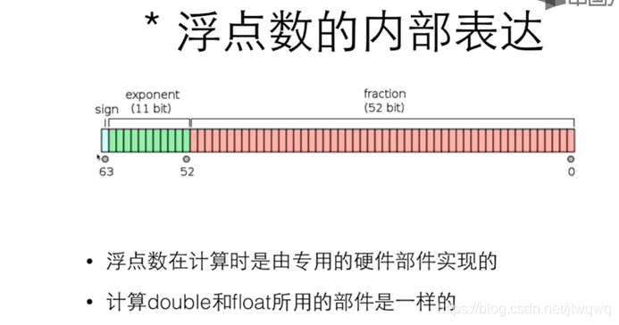

变量和常用的数据类型

<!--more-->

# 变量和常用的数据类型

## 变量的定义和使用

### 变量的定义

- 变量的一般定义：<类型名称> <变量名称>
- 变量的名字叫`标识符`，由字母、数字、下划线构成，其中数字不能作为首字符
- 变量的初始化和复制
  ```C
    int i; // 初始化
    i = 0; // 赋值
    int i = 0; // 初始化并赋值
  ```

### 变量的输入和输出

- scanf() 输入变量
  ```C
    int i;
    scanf("%d", &i); // 注意变量 i 前的 & 符。
    scanf("print %d", &i) // !!! 对于scanf中的格式化字符是必须输入的，因此终端中应该输入 "print xxx"
  ```
- printf() 输出变量
  ```C
    int i = 2;
    printf("i = %d", i); //输出 i = 2
  ```

### 算子和运算符

- 算子和运算符
  ```C
  a = b + c; // 其中 a, b, c 被称为算子；=, +被称为运算符
  ```
- 运算符的优先级

  | 优先级 | 运算符 | 运算     | 结合关系 | 示例  |
  | ------ | ------ | -------- | -------- | ----- |
  | 1      | +      | 单目不变 | 自右向左 | a\*+b |
  | 1      | -      | 单目取负 | 自右向左 | a\*-b |
  | 2      | \*     | 乘       | 自左向右 | a\*b  |
  | 2      | /      | 除       | 自左向右 | a/b   |
  | 2      | %      | 取余     | 自左向右 | a%b   |
  | 3      | +      | 加       | 自左向右 | a+b   |
  | 3      | -      | 减       | 自左向右 | a-b   |
  | 4      | =      | 赋值     | 自右向左 | a=b   |

- 特别说明：`a++` 和 `++a` 的不同：
  ```C
    ++1; // 返回的值是2，并实现 +1 的功能
    1++; // 返回的值是1，并实现 +1 的功能
  ```

## 数据类型

### 基本数据类型

- 整型：`char`, `short`, `int`, `long`, `long long`
  - sizeof():给出某个类型或变量在内存中所占据的字节数
    ```C
    #include<stdio.h>
    int main(){
        printf("sizeof(char) = %ld\n", sizeof(char)); // 1字节（8比特）
        printf("sizeof(short) = %ld\n", sizeof(short)); // 2字节
        printf("sizeof(int) = %ld\n", sizeof(int)); // 取决于编译器（CPU） 一般 4 字节
        printf("sizeof(long) = %ld\n", sizeof(long)); // 取决于编译器（CPU） 一般 4 字节
        printf("sizeof(long long) = %ld\n", sizeof(long long)); // 8字节
        return 0;
    }
    ```
    | 类型      | 字长          | 范围                 |
    | --------- | ------------- | -------------------- |
    | char      | 1             | -128~127             |
    | short     | 2             | -2$^{15}$~2^${15}-1$ |
    | int       | 4(取决编译器) | -2$^{31}$~2^${31}-1$ |
    | long      | 4             | -2$^{31}$~2^${31}-1$ |
    | long long | 8             | -2$^{63}$~2^${63}-1$ |
  - int：一般一个`int`表示一个寄存器(RAM)的大小,即每次从 CPU 中取 32bit，不同的计算机得到的`sizeof(int)`可能不一样
  - 整数在计算机中的内部表达
    - 计算机内部，一切都是二进制，其中分为有符号数和无符号数(`unsigned`)
    - 有符号数：最高位作为符号位，可表示正数、负数和 `0` 的整数。例如：`char`可表示有符号整数的范围 `-128~127`。
      - 原码(Sign-Magnitude)：二进制最直观表达，最高位是符号位，其中 `0` 表示正数，`1` 表示负数。例如：`+5` 的原码是 `0000 0101`;-5 的原码是 `1000 0101`。
      - 反码(One's Complement)：正数的反码就是其原码；负数在原码的基础上，除了符号位不变，其余位取反得到的结果。例如，`+5` 的反码是`0000 0101`; `-5` 的反码是 `1111 1010`。
      - 补码(Two's Complement)：正数的补码就是其原码；负数的补码在反码的基础上加 1。例如：`+5` 的补码是`0000 0101`;`-5`的补码是 `1111 1011`。
      - **补充说明**：对于无符号数，一个字节表达的范围：`0~255`;对于有符号数，一个字节表达的范围：`-128~127`。其中，正数范围是 0~127，对应二进制 `0000 0000~0111 1111`；**重点！！** 负数对应十进制范围 `-128~-1`，对于二进制中最大的表示为 `1111 1111`，去掉最高符号位不看，对应的值是 127。所以按正常情况看，负数最小值只有 -127，那么-128 应该怎么表示呢？嗯哼~如果按正常情况看，1000 0000 表达的-0，有符号数就会出现两个 0，因此把其中一个 0 指定为 -128 是不是就可以了？但是这么做会出现两个问题：1、-127 和 -128 的跨度太大；2、硬件中影响运算；**重点 2！！** 所以在计算机中，负数可以采用补码的形式表示，如 -1 ，原码为 `1000 0001`，反码为 `1111 1110`，补码为 `1111 1111`(不看最高位，`111 1111` 表达的也是最大的值，对应最大的-1)；最大的-1，对应补码的表示 `11111 1111`，-1 减去 1 得到 -2，对应的补码表示为 `1111 1110`，以此类推，-128 对应的补码表示 `1000 0000`。最后，负数的原码加上其补码等于 0。 --节选自[原码、反码、补码，计算机中负数的表示](https://developer.aliyun.com/article/330347)
    - 无符号(unsigned)数：只表示纯二进制(主要是为了移位)，非负数。例如：`unsigned char` 可表示的范围 `0~255`。
- 浮点型：`float`, `double`, `long double`

  - 浮点数类型：

    | 类型   | 字长 | 范围                                              | 有效数字 | scanf | printf           |
    | ------ | ---- | ------------------------------------------------- | -------- | ----- | ---------------- |
    | float  | 32   | ±(1.2x $10^{-38}$~3.40x$10^{38}$), 0, ±inf, nan   | 7        | %f    | %f, %e(科学计数) |
    | double | 64   | ±(2.2x $10^{-308}$~1.79x$10^{308}$), 0, ±inf, nan | 15       | %lf   | %f, %e(科学计数) |

  - 浮点运算的精度

    - 带小数点的字面量意思是 double 而非 float
    - float 需要用 f 或 F 后缀来表明身份
      ```C
          float a, b, c;
          a = 1.345f;
          b = 1.123f;
          c = a + b;
          if (c == 2.468)
              printf("相等\n");
          else
              printf("不相等！c=%.10f, 或%f\n", c, c)  // f1 == f2 可能失败 ； fabs(f1-f2) < 1e-12 验证;
      ```

  - 浮点数的内部表达：
  - 
    - sign(1 bit)：符号位
    - exponent(11 bit)：指数位
    - fraction(52 bit)：小数位

- 字符型：`char`：char 是整数，也是字符

  ```C
    #include <stdio.h>

    int main(int argc, const char *argv[])
    {
        char c;
        c = '1';
        printf("c=%d", c);  // 1
        printf("c=%c", c); // ASIIC码--49

        return 0;
    }
  ```

- 布尔型：`bool`(C99 引入)
  逻辑类型(bool)和逻辑运算
  | 运算符 | 描述 | 示例 | 结果 |
  | ------ | ------ | -------- | ------------------------------------------------------------------------ |
  | ! | 逻辑非 | !a | 如果 a 是 true 结果就是 false；如果 a 是 false，结果就是 true； |
  | && | 逻辑与 | a && b | 如果 a 和 b 都是 true，结果就是 true；否则就是 false； |
  | \|\| | 逻辑或 | a \|\| b | 如果 a 和 b 中有一个是 true，结果为 true；两个都为 false，结果为 false； |

- 逃逸字符：用来表达无法打印出来的控制字符或者特殊字符，他由一个反斜杠"\"开头，后面跟上另一个字符，这两个字符合起来，组成一个字符。

  | 字符 | 意义           | 字符 | 意义       |
  | ---- | -------------- | ---- | ---------- |
  | \b   | 回退一格       | \"   | 双引号     |
  | \t   | 到下一个表格位 | \'   | 单引号     |
  | \\n  | 换行           | \\   | 反斜杠本身 |
  | \r   | 回车           |      |            |

- 类型转换：

  - 自动类型转换：
    - 当运算符两边出现不一样类型时，会自动转换成较大（范围大）的类型；
    - char-->short-->int-->long-->long long
    - int-->float-->double
    - 注：
      - 对于 printf，任何小于 int 类型的都会转换成 int；float 会被转换成 double；
      - 对于 scanf 则不会，要输入 short，需要 %hd
  - 强制转换：优先级高于四则运算
    - (类型)值
      ```C
      (int)32.3
      (short)32
      ```
    - 注意小的变量不总能表达大的变量

- 运算符及其优先级

  - 运算符优先级

    | 优先级 | 运算符            | 结合性                 |
    | ------ | ----------------- | ---------------------- |
    | 1      | （）              | 从左到右               |
    | 2      | ! + - ++ --       | 从右到左（单目的+和-） |
    | 3      | \_ / %            | 从左到右               |
    | 4      | + -               | 从左到右               |
    | 5      | <<= >>=           | 从左到右               |
    | 6      | == !=             | 从左到右               |
    | 7      | &&                | 从左到右               |
    | 8      | \|\|              | 从左到右               |
    | 9      | = += -= \_= /= %= | 从左到右               |

  - 条件运算符：自右向左
    ```c
        m<n ?  a:a+5 // (条件) ? a : b
    ```
  - 逗号运算符：所有运算符中优先级最低的
    ```C
        for(i=0, j=10; i<j; i++, j--) // 基本上只有 for 条件会用到
    ```

### 构造数据类型

- 数组：`int arr[10]`

  - 数组的定义
    - <类型> 变量名[元素数量]；
    - int grades[100];
    - double weight[20];

- 结构体：`struct`

  ```C
    // 结构体定义的三种方式
    // 1# 声明和定义
    struct date {
        int month;
        int day;
        int year;
    };
    struct date today;

    //2# 结构体定义
    struct {
        int x,
        int y
    } p1, p2;

    // 3# 另一种
    struct piont {
        int x,
        int y
    } p1, p2; // 既声明有定义

    // 初始化
    struct date today = {7， 31， 2023};
    struct data miao = {.month=7, .year=2023};

  ```

  - 结构跟数组有点像：
    - 要访问整个结构，直接用结构变量的名字
    - 对于整个结构，可以做赋值、取地址、也可以传递给函数参数
      - p1=(struct point){5, 10}; //相当于 p1.x=5, p1.y=10
      - p1 = p2; // 相当于 p1.x = p2.x; p1.y = p2.y;

- 联合体：`union`：共同使用一个空间

  ```C
    union Shape {
    int width;
    int height;
    float radius;
    };  // 使用联合时，只能同时访问一个成员，以确保数据的一致性

    union Shape shape;
    shape.width = 10;
    shape.height = 20;
    printf("Width: %d\n", shape.width);  // Width:20
    printf("Height: %d\n", shape.height); // Height:20
  ```

- 枚举类型：`enum`
  - 枚举：enum 枚举类型名字 {名字 0, 名字 1, 名字 2, ...};
    ```C
        enum COLOR {RED, YELLOW, GREEN};
    ```

### 指针类型

- 指针：`int *p`：就是保存地址的变量
  ```C
    int *ptr; // 指针的定义
    int i;
    int* p = &1; // 指针的定义及初始化
    int* p, q;  // p是一个指针，指向int 同下；q不是一个指针；
    int *p, q; // 同上
    int *ptr = (int *)malloc(sizeof(int)); // 动态分配内存，使用完要用free释放
  ```
- 数组指针：`int (*p)[10]`:数组指针是指向数组的指针变量，可以用来访问和操作数组的元素。

  ```C
    int (*ptr)[5];  // 数据类型 (*指针变量名)[数组长度]; 一维数组
    int (*ptr)[3][4]; // 数据类型 (*指针变量名)[行数][列数]; 二维数组
  ```

- 函数指针：`int (*p)()`：函数指针是指向函数的指针变量，可以使用函数指针来调用函数或者将函数作为参数传递给其他函数。

  ```C
    int add(int a, int b) {
    return a + b;
    }
    int (*ptr)(int, int) = add; // 返回类型 (*指针变量名)(参数列表);
  ```

- 指针函数：`int* creatArray(int size)`：是指返回类型为指针的函数。它是一种函数类型，可以将其定义为指针变量。
  ```C
    int* createArray(int size) {
    int* arr = malloc(size * sizeof(int));
    // 其他操作...
    return arr;
    }  // 指针函数：返回 arr 指向的地址
    int* (*func)(int) = createArray;  // 函数指针：指向createArray
  ```

### 其他数据类型

- 空类型：`void`
  ```C
    void swap(double a, double b); // 与函数名称相同
    void swap(void)  // 无参数
  ```
- 自定义类型：`typedef`
  - typedef 用来声明一个已有数据类型的新名字比如：typedef int Length；
  - 声明之后，Length 就可以替代 int
  - 与结构体相关用法
    ```C
    typedef long int64_t;
    typedef struct ADate{
        int month;
        int day;
        int year;
    } Date;  // 简化了复杂的结构体，用 Date 代替 结构体
    int64_t i = 1000000000000;
    Date d = {9, 1, 2005}; // 简单又高效!!!
    ```

## 参考文献

- [翁恺 C 语言程序设计网课笔记合集--数据类型](https://blog.csdn.net/jtwqwq/article/details/126117006?utm_medium=distribute.pc_relevant.none-task-blog-2~default~baidujs_baidulandingword~default-0-126117006-blog-112693791.235^v38^pc_relevant_anti_vip&spm=1001.2101.3001.4242.1&utm_relevant_index=1#6__1029)
- [原码、反码、补码，计算机中负数的表示](https://developer.aliyun.com/article/330347)
